# Projet-Raytracer-M1-IMAGINE-

Projet réalisé tout au long du 1er semestre du Master 1 Imagine à l'Université de Montpellier. Ce projet avait pour objectifs de comprendre le Raytracing de manière général.

**Exemples de rendus :
     <figure>         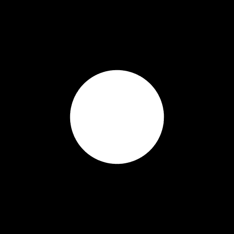         <figcaption>Cercle simple</figcaption>     </figure>      <figure>         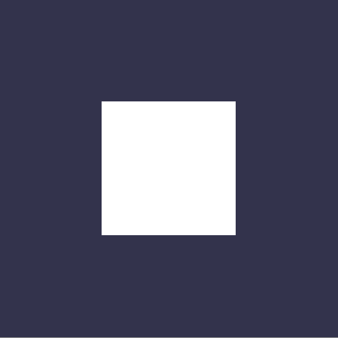         <figcaption>Carré simple</figcaption>     </figure>      <figure>         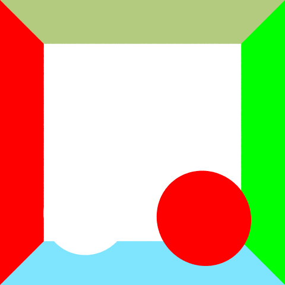         <figcaption>Boîte de Cornell sans illumination</figcaption>     </figure>      <figure>                  <figcaption>Boîte de Cornell avec illumination de Phong + ombres dures</figcaption>     </figure>      <figure>         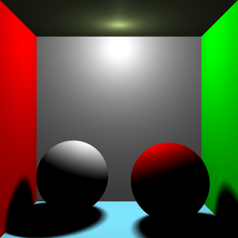         <figcaption>Boîte de Cornell avec illumination de Phong + ombres douces</figcaption>     </figure>      <figure>         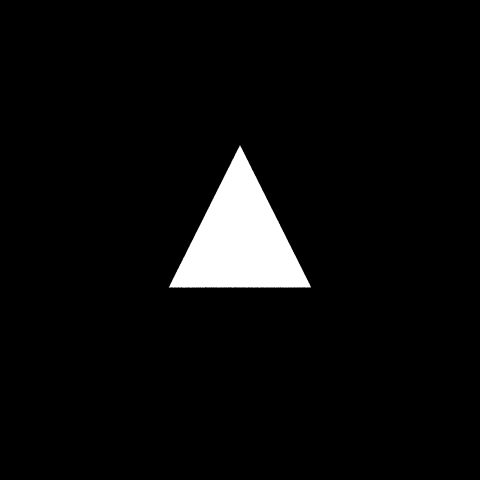         <figcaption>Simple triangle</figcaption>     </figure>      <figure>         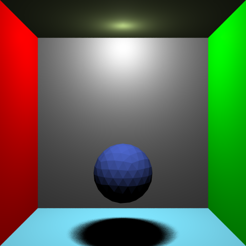         <figcaption>Sphère composée de triangles</figcaption>     </figure>      <figure>         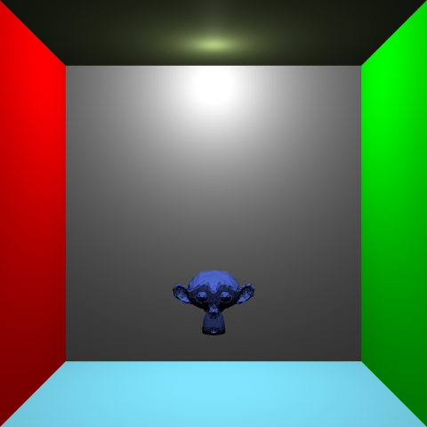         <figcaption>Suzanne</figcaption>     </figure>      <figure>         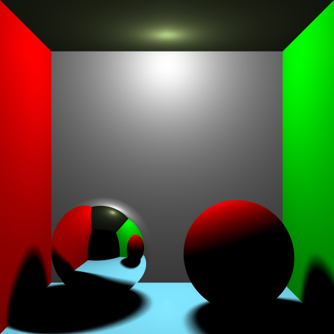         <figcaption>Sphère réfléchissante</figcaption>     </figure>      <figure>         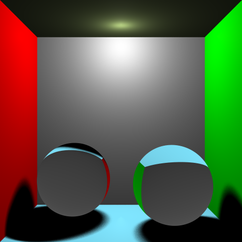         <figcaption>Sphère qui réfracte</figcaption>     </figure>      <figure>         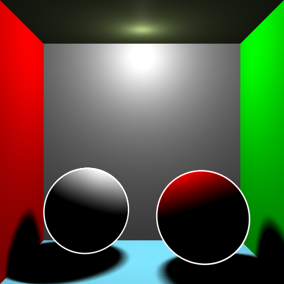         <figcaption>Shader de Rim</figcaption>     </figure>      <figure>         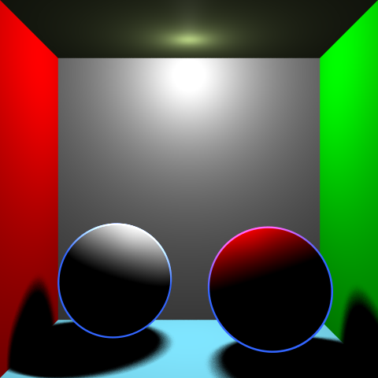         <figcaption>Shader de Rim (avec des valeurs différentes)</figcaption>     </figure>      <figure>         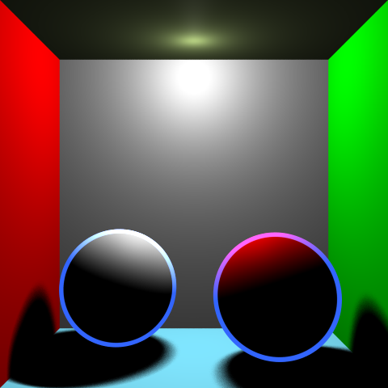         <figcaption>Shader de Rim (avec des valeurs différentes)</figcaption>     </figure>      <figure>         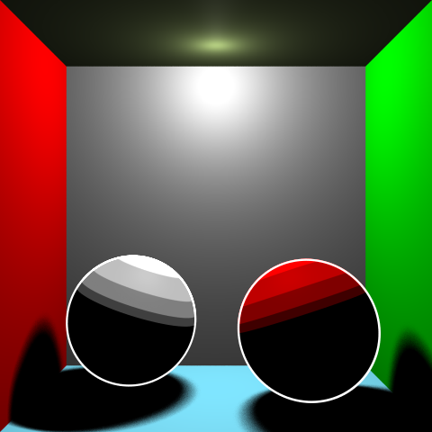         <figcaption>Toon shading</figcaption>     </figure>      <figure>         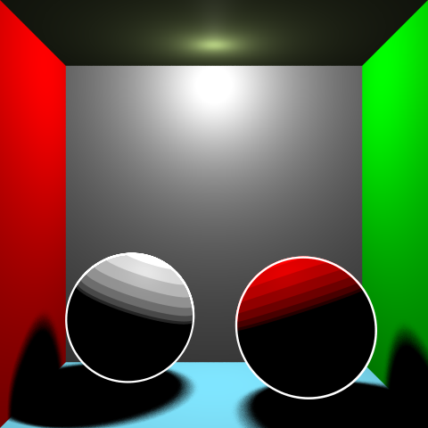         <figcaption>Toon shading (avec des seuils différents)</figcaption>     </figure> 
