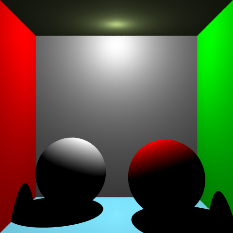

# Projet-Raytracer-M1-IMAGINE-

Projet réalisé tout au long du 1er semestre du Master 1 Imagine à l'Université de Montpellier. Ce projet avait pour objectifs de comprendre le Raytracing de manière général.

\## Exemples de rendus :

<figure>      <figcaption>Cercle simple</figcaption> </figure> 

<figure>      <figcaption>Carré simple</figcaption> </figure> 

<figure>      <figcaption>Boîte de Cornell sans illumination</figcaption> </figure> 

<figure>      <figcaption>Boîte de Cornell avec illumination de Phong + ombres dures</figcaption> </figure> 

<figure>      <figcaption>Boîte de Cornell avec illumination de Phong + ombres douces</figcaption> </figure> 

<figure>      <figcaption>Simple triangle</figcaption> </figure> 

<figure>      <figcaption>Sphère composée de triangles</figcaption> </figure> 

<figure>      <figcaption>Suzanne</figcaption> </figure> 

<figure>      <figcaption>Sphère réfléchissante</figcaption> </figure> 

<figure>      <figcaption>Sphère qui réfracte</figcaption> </figure> 

<figure>      <figcaption>Shader de Rim</figcaption> </figure> 

<figure>      <figcaption>Shader de Rim (avec des valeurs différentes)</figcaption> </figure> 

<figure>      <figcaption>Shader de Rim (avec des valeurs différentes)</figcaption> </figure> 

<figure>      <figcaption>Toon shading</figcaption> </figure> 

<figure>      <figcaption>Toon shading (aves des seuils différents)</figcaption> </figure> 
